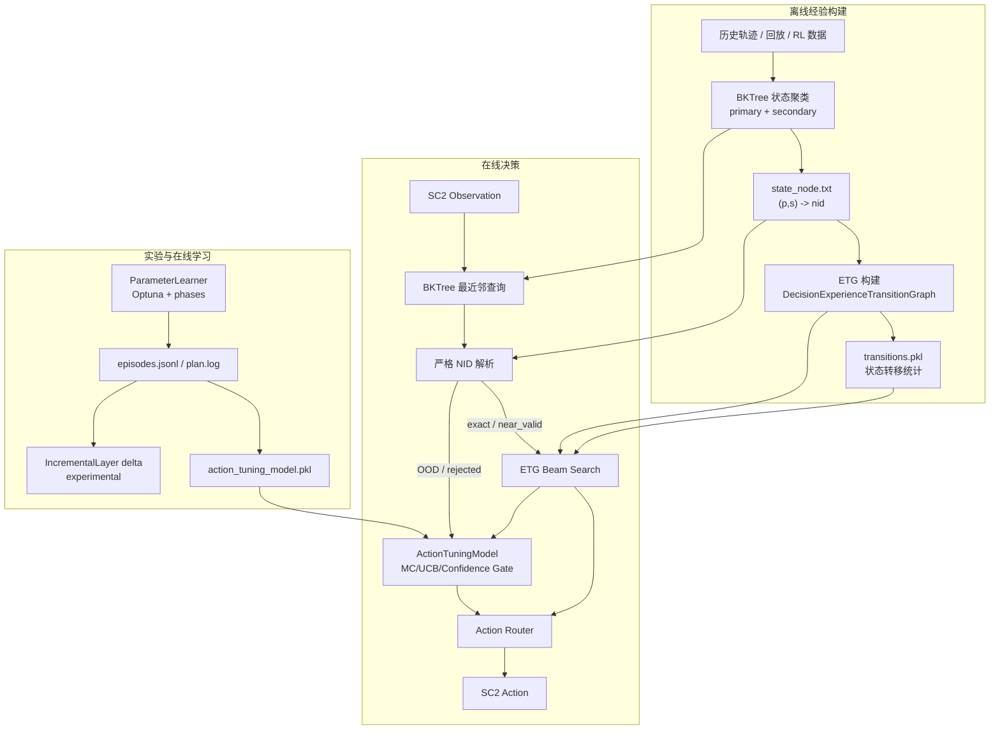

# PredictionRTS 项目架构与研究动机

> 当前文档按 2026-05-08 的实现状态重写。项目主线已经不再只是“ETG + Beam Search 的离线图规划系统”，而是一个围绕 **etg/BKTree 基线知识、在线参数寻优、蒙特卡洛动作微调、OOD 状态处理与可视化诊断** 共同构成的 RTS 微操决策实验平台。

---

## 1. 本工作要解决什么问题

PredictionRTS 面向 StarCraft II 微操场景，核心问题是：

> 如何把历史强化学习/回放轨迹中的经验转化为可解释、可检索、可在线修正的决策系统，使 Agent 在连续、高维、长尾且奖励延迟的 RTS 状态空间中稳定选择动作。

当前系统不是端到端神经策略，而是采用“离线经验图 + 在线规划 + 动作微调探索”的混合范式：

1. 用 BKTree 将连续战斗状态压缩为离散状态簇。
2. 用 ETG（Experience Transition Graph）统计历史状态-动作-转移经验。
3. 在 ETG 上执行 Beam Search，得到可解释的规划动作。
4. 当 etg/BKTree 覆盖不足、NID 映射不可靠、或动作置信度不足时，引入独立的蒙特卡洛动作微调模型。
5. 用参数寻优、分阶段实验和可视化日志判断 ETG 与探索微调是否真正协同。

---

## 2. 核心动机

### 2.1 现有主流方法及其局限

针对 RTS 微操决策，现有研究和工程实践通常有几类主流路径：

| 方法 | 基本思路 | 主要局限 |
|---|---|---|
| 端到端强化学习 | 直接学习从 observation 到 action 的策略或价值函数 | 样本效率低、训练成本高、结果可解释性弱，策略失败时难以定位原因 |
| 模仿学习 / 行为克隆 | 从专家或高分轨迹中学习动作分布 | 容易复制数据偏差；遇到分布外状态时误差累积；无法主动发现比示例更优的动作 |
| 深度强化学习 + 自博弈 | 通过大规模交互提升泛化能力 | 对算力和环境交互量要求高；微小规则或地图变化可能导致重训成本高 |
| 层次化 RL | 将战略、战术、微操分层建模 | 子目标设计困难；高层决策与低层动作的信用分配仍然复杂 |
| MCTS / 在线搜索 | 在当前状态向前模拟并选择高价值动作 | RTS 状态分支巨大，真实环境模拟昂贵；若没有可靠模型，搜索深度和质量受限 |
| 模型预测控制 / 学习转移模型 | 学习状态转移，再做短视滚动规划 | 转移模型误差会随规划深度累积；长程结果对局部误差敏感 |
| 经验回放检索 / 案例推理 | 在历史轨迹中寻找相似状态和动作 | 相似状态定义困难；历史动作不一定适合当前局部细节 |

这些方法分别解决了问题的一部分，但很难同时满足本项目需要的几个条件：

- **可解释**：需要知道动作来自哪条经验、哪个状态、哪个规划路径。
- **可在线运行**：不能依赖大量实时模拟或昂贵重训练。
- **可修正**：当历史经验不可靠时，需要有机制发现并验证替代动作。
- **可诊断**：实验曲线下降时，需要能定位是状态映射、规划参数、探索污染还是动作模型问题。
- **可增量扩展**：新探索到的有效经验不能简单覆盖原模型，也不能永久游离在体系之外。

### 2.2 长程规划问题的共性局限

本项目中的微操决策虽然是短时间尺度动作选择，但本质上仍包含长程规划问题：单步动作的收益并不总是立刻显现，最终胜负或血量差往往要到 episode 结束才明确。因此，它与一般长程决策问题共享几类困难：

- **奖励延迟**：当前动作可能在几十帧后才体现收益，单步 HP 变化不足以完整评价动作质量。
- **组合爆炸**：每一步有多个聚类粒度和动作选择，多步展开后搜索空间迅速膨胀。
- **模型误差累积**：如果用学习到的转移模型向前推演，早期一点状态误差会在后续不断放大。
- **局部最优与全局目标冲突**：短期看似保守或低收益的动作，可能为后续集火、拉扯、阵型调整创造条件。
- **分布外状态不可避免**：在线运行会遇到历史数据中没有充分覆盖的血量、位置和单位数量组合。
- **信用分配困难**：episode 结束后的胜负/血量差需要分配给轨迹上的多个动作，错误分配会污染动作价值估计。

这说明，仅依赖端到端策略、纯在线搜索或纯历史检索都不够稳健。系统需要一个可解释的经验骨架，同时保留在线修正能力。

### 2.3 为什么引入 ETG 与 Beam Search

ETG 与 Beam Search 是对上述问题的折中：

- ETG 把历史轨迹压缩为显式的状态-动作-转移图，保留访问次数、胜率、质量分数和未来奖励等统计量。
- BKTree 提供从连续状态到离散图节点的索引，使实时 observation 可以映射到历史经验空间。
- Beam Search 在 ETG 上做有限深度前向规划，避免完全短视地只看当前动作统计。
- 相比端到端策略，etg/Beam Search 更可解释：每个动作都能追溯到候选路径、转移概率和统计依据。
- 相比 MCTS，etg/Beam Search 不需要在线真实模拟大量分支，而是复用离线经验图。

因此，本项目首先以 etg/BKTree/Beam Search 构建稳定、可解释的经验规划基线。但这只是基线，不是终点。由于 ETG 的经验来自有限历史数据，它仍会受到覆盖不足、长尾统计和错误状态映射的限制，这正是后续引入严格 NID、OOD 通道和动作微调模型的原因。

### 2.4 单纯 etg/Beam Search 的局限

ETG 的优势是可解释、可复现、能利用历史轨迹统计。但在当前微操场景中，它面临几个结构性问题：

- **状态空间连续且巨大**：同样是 `4v4 Marine`，单位位置、血量、阵型微小变化都会形成新状态。
- **经验分布极度长尾**：大量 state-action 边只出现 1 次，统计量高度不可靠。
- **BKTree 离散化存在误映射风险**：最近邻状态不一定语义等价，错误 NID 会把当前状态送入错误 ETG 节点。
- **终局和低频状态覆盖不足**：对局末期状态变化快，历史轨迹不一定覆盖所有细节。
- **Beam Search 只能在已有图上规划**：ETG 没有可靠动作时，Beam Search 只能回退、放宽或使用 fallback。

### 2.5 单纯在线探索的局限

蒙特卡洛探索可以发现 ETG 没有覆盖或统计错误的动作，但它也有明显风险：

- RTS episode 的明确奖励通常要到对局结束才知道，逐步信用分配困难。
- 盲目探索会显著拉低优化目标，使参数寻优曲线难以解释。
- 探索模型如果被低质量 episode 污染，可能反过来破坏协同阶段。
- 若不区分 ETG 利用、探索训练、协同验证，实验结果会混在一起，无法判断模块贡献。

### 2.6 当前工作的核心思想

本项目当前追求的不是“完全替代 ETG”，而是：

> 保留 etg/BKTree 作为可解释经验基线，在其不可靠或低置信时，通过独立动作微调模型进行受控探索与修正，并用严格日志和分阶段实验判断二者是否互相促进。

因此，动作微调模型默认不直接改写原始 etg/BKTree；增量层也以 delta 的形式独立保存，避免污染离线基线。

---

## 3. 本工作拟解决的主要难点

| 难点 | 具体表现 | 当前处理思路 |
|---|---|---|
| 连续状态离散化 | 单位位置/血量连续变化，直接建图不可行 | BKTree 两级聚类：primary 表示空间分布，secondary 表示血量/细节分布 |
| NID 可靠性 | 最近邻 `(p,s)` 可能没有对应 ETG nid，或距离过大 | 严格 NID 解析；超过阈值进入 OOD 通道 |
| 经验长尾 | ETG 中大量低访问边统计不可信 | `min_visits`、Beam Search 过滤、fallback、动作微调补充 |
| 奖励延迟 | 最终奖励要 episode 结束才能准确得到 | `ActionTuningModel.update_episode()` 使用蒙特卡洛回报反向更新 |
| 探索污染 | 低分/高 OOD episode 可能污染模型 | RestartGuard、warm-up、跳过更新、OOD 探索熔断 |
| 协同归因 | 优化曲线混合 ETG 参数与动作探索效果 | 分阶段优化、动作来源占比、etg/探索平衡曲线、候选表 |
| 运行一致性 | SC2 重启、参数热更新、阈值不一致会造成实验漂移 | 阶段切换重启；BKTree 阈值侧边栏配置并传递到运行期 |
| 可解释性 | 需要知道每一步动作来自 ETG、fallback、探索还是 tuning | `action_source`、`nid_status`、`action_tuning`、phase 日志字段 |

---

## 4. 总体架构



---

## 5. 核心数据与概念

### 5.1 状态表示

SC2 原始 observation 会被抽取为归一化状态：

```text
state_norm = {
  red_army:  [(x_norm, y_norm, hp_norm), ...],
  blue_army: [(x_norm, y_norm, hp_norm), ...]
}
```

状态经过 BKTree 查询得到：

```text
state_cluster = (primary_id, secondary_id)
```

再通过：

```text
state_node.txt: (primary_id, secondary_id) -> nid
```

映射到 ETG 节点。

### 5.2 BKTree 阈值

当前系统区分：

- **数据生成/重采样扩张阶段**：用阈值决定是否新增聚类节点。
- **规划决策阶段**：用最近邻查询得到 `(p,s)`，再用阈值判断这个最近邻是否可靠。

当前默认：

```text
MarineMicro_MvsM_4:
  primary_threshold = 0.7
  secondary_threshold = 0.5
```

这些默认值集中定义在 `scripts/etg_web/constants.py`，并在实时对局、重采样扩张、参数寻优侧边栏中可修改。

### 5.3 NID 解析状态

当前 `ETGGuidedAgent` 不再把所有最近邻都强行当成可靠 nid，而是记录解析质量：

| 状态 | 含义 | 决策影响 |
|---|---|---|
| `exact` | `(p,s)` 在 `state_node.txt` 中直接命中 | 可进入 ETG Beam Search |
| `near_valid` | 直接未命中，但同 primary 下最近 nid 距离和 HP 距离在阈值内 | 作为 fallback nid 使用 |
| `near_rejected` | 最近 nid 距离过大 | 进入 OOD 动作微调通道 |
| `bktree_rejected` | BKTree 最近邻本身超过 primary/secondary 阈值 | 进入 OOD 动作微调通道 |
| `missing` | 无法可靠解析 | fallback 或 OOD 通道 |

### 5.4 动作编码

动作编码格式：

```text
{cluster_index}{action_letter}
```

- `cluster_index`: `0..4`，对应不同 k-means 聚类粒度。
- `action_letter`: `a..k`，对应具体微操动作。

常见映射：

| 字母 | 动作 |
|---|---|
| `a` | `action_ATK_nearest` |
| `b` | `action_ATK_clu_nearest` |
| `c` | `action_ATK_nearest_weakest` |
| `d` | `action_ATK_clu_nearest_weakest` |
| `e` | `action_ATK_threatening` |
| `f` | `action_DEF_clu_nearest` |
| `g` | `action_MIX_gather` |
| `h` | `action_MIX_lure` |
| `i` | `action_MIX_sacrifice_lure` |
| `j` | `do_randomly` |
| `k` | `do_nothing` |

注意：当前设计不强制屏蔽 `j/k`。如果采样与蒙特卡洛回报更新正确，低效动作应通过低回报自然降低后续采样概率。若仍长期出现，需要优先检查回报更新、episode 终止记录、RestartGuard 跳过更新、以及 tuning 统计是否正确。

---

## 6. 离线经验构建链路

### 6.1 数据来源

离线数据主要来自：

- 历史 RL 训练轨迹。
- 回放重演产生的状态与动作。
- 重采样数据集扩张功能生成的更多 episode。

关键文件：

```text
data/{map_id}/{data_id}/
  bktree/
    primary_bktree.json
    secondary_bktree_*.json
  graph/
    state_node.txt
  datas/
    ...
```

### 6.2 ETG 构建

`DecisionExperienceTransitionGraph` 聚合历史轨迹中的：

- `visits`
- `win_rate`
- `avg_step_reward`
- `avg_future_reward`
- `quality_score`
- `state -> action -> next_state` 转移统计

主要产物：

```text
cache/experience_transition_graph/{etg_name}/etg_simple.pkl
cache/experience_transition_graph/{etg_name}/etg_simple_transitions.pkl
cache/npy/state_distance_matrix_{map_id}_{data_id}.npy
```

### 6.3 重采样数据集扩张

实时对局 Tab 中的“重采样数据集扩张（批量回放重演）”使用 `ReplayCollector` 批量重放已有动作序列，并以可配置 BKTree 阈值增量构建状态簇。该功能用于扩展原始数据覆盖，而不是直接参与当前 run 的在线动作微调。

---

## 7. 在线决策链路

### 7.1 运行入口

主要入口：

```bash
python scripts/run_live_game.py --mode all \
  --map_key sce-1 \
  --etg_file MarineMicro_MvsM_4_augmented/etg_simple.pkl \
  --data_dir data/MarineMicro_MvsM_4/augmented_1
```

`run_live_game.py` 会启动：

1. SC2 游戏进程。
2. `ETGGuidedAgent`。
3. FastAPI bridge server。

Web 入口：

```bash
streamlit run scripts/visualize_etg_web.py
```

### 7.2 ETGGuidedAgent 决策步骤

每一帧核心流程：

```text
1. 从 SC2 observation 抽取我方/敌方单位状态
2. 归一化为 state_norm
3. 查询 BKTree 得到 (p,s) 和距离
4. 严格解析 NID:
   - exact / near_valid -> ETG Beam Search
   - rejected / missing -> OOD 动作微调通道
5. ETG Beam Search 给出 etg_action
6. ActionTuningModel 根据 event_type 决定：
   - 保持 ETG
   - 使用 tuning 替代
   - 使用 mc_explore 探索
7. 执行动作并记录 frame
8. episode 结束后写入 episodes.jsonl，并按 guard 决策更新模型
```

### 7.3 动作来源

日志中的 `action_source` 是判断系统行为的关键字段：

| 来源 | 含义 |
|---|---|
| `etg_plan` | etg/Beam Search 新规划 |
| `etg_follow` | 跟随已有规划 |
| `etg_relaxed` | 放宽条件后的 ETG 规划 |
| `diverge` | 当前状态偏离计划后的重规划 |
| `fallback` | 安全回退动作 |
| `mc_explore` | 动作微调模型的 UCB 主动探索 |
| `tuning` | 动作微调模型基于置信度接受替代动作 |
| `ood` | etg/BKTree 外状态的基础 OOD 通道 |
| `ood_mc_explore` | OOD 状态中的 UCB 探索 |
| `ood_tuning` | OOD 状态中的 tuning 替代 |
| `terminal_fix` | 终局兜底动作 |

---

## 8. ETG Beam Search

Beam Search 的输入是当前 `nid` 和 ETG 统计。它会：

1. 从当前状态取 top-k 动作。
2. 按 `score_mode` 计算动作价值。
3. 根据转移概率扩展下一层状态。
4. 保留 `beam_width` 条候选路径。
5. 按 `action_strategy` 选择最终动作。

关键参数：

| 参数 | 作用 |
|---|---|
| `beam_width` | 每层保留候选路径数量 |
| `lookahead_steps` | 搜索深度 |
| `score_mode` | 使用 quality / future_reward / win_rate |
| `min_visits` | 过滤低访问经验边 |
| `min_cum_prob` | 累积概率剪枝 |
| `discount_factor` | 未来路径折扣 |
| `max_state_revisits` | 限制路径内重复状态 |
| `action_strategy` | 最终路径/动作选择策略 |
| `enable_backup` | 是否启用 backup switch |

Beam Search 是当前可解释规划基线。它的不足是无法主动创造 ETG 中不存在的经验，因此需要动作微调和 OOD 通道补充。

---

## 9. 蒙特卡洛动作微调

### 9.1 设计定位

`ActionTuningModel` 是独立于 ETG 的在线动作价值模型。它不直接覆盖 ETG 文件，而是在运行过程中维护：

```text
state_action_stats[state_id][action_code] = TuningActionStats
```

每个 `TuningActionStats` 包含：

- `visits`
- `wins`
- `mean_return`
- `std_return`
- `confidence`
- `last_updated`

### 9.2 UCB 探索

探索阶段使用 UCB：

```text
ucb_score(s,a) = mean_return(s,a) + c * sqrt(log(total_visits(s)+1) / visits(s,a))
```

未访问动作的 UCB 为无穷大，因此模型会优先采样未探索动作。这是设计预期，但也要求 episode 回报更新必须正确，否则低效动作不会被及时压低。

### 9.3 置信度门控

非探索阶段，模型会比较最佳微调动作与 ETG 动作：

```text
if candidate != etg_action
   and visits >= min_visits
   and confidence >= min_confidence
   and advantage >= min_advantage:
       使用 tuning
else:
       保持 ETG
```

对 OOD/fallback/etg_relaxed 等低置信来源，可使用更低的 validation gate。

### 9.4 回报更新

episode 结束后，模型按轨迹反向更新：

```text
running_return = final_score + outcome_bonus
for step in reversed(trajectory):
    running_return = step_reward + discount_factor * running_return
    update(state_id, action_code, running_return)
```

支持：

- `every_visit`
- `first_visit`

当前需要重点验证的是：终局低效动作、dogfall、RestartGuard 跳过更新等情况下，低回报是否真实进入模型。

---

## 10. OOD 通道与严格 NID 解析

### 10.1 为什么需要 OOD 通道

早期实现中，BKTree 最近邻只要能返回 `(p,s)`，系统就倾向于强行使用对应 nid。这样会导致：

- 当前状态被错误映射到历史状态。
- Beam Search 在错误节点上规划。
- tuning 统计被写到错误 state_id。

当前设计中，NID 解析不可靠时会生成 OOD state key：

```text
ood:{base_nid}:{p}-{s}:agg:d{distance_bucket}
```

或 exact 模式：

```text
ood:{p}:{s}:{digest}:d{distance}
```

### 10.2 OOD 决策含义

OOD 不代表“状态无价值”，而代表“不能安全使用原 ETG nid”。高分 OOD episode 反而可能是重要候选，说明当前 etg/BKTree 覆盖存在缺口。

因此 Web 中保留高分 OOD 状态候选表，用于后续判断是否应进入增量层或重建 BKTree/etg。

---

## 11. RestartGuard 与模型更新保护

RestartGuard 的目的不是追求 BKTree 覆盖率，而是保护在线学习过程不被明显异常 episode 污染。

主要条件：

- 重启后 warm-up 若干 episode 只记录、不更新模型。
- OOD 比例过高时跳过模型更新。
- OOD 探索比例过高时可熔断 OOD explore。
- bad result 可跳过更新。
- 高分 OOD 可例外保留，用于发现有价值的新状态。

典型日志字段：

```text
restart_guard.skip_update
restart_guard.disable_ood_explore
restart_guard.ood_ratio
restart_guard.ood_mc_ratio
restart_guard.high_score_ood_allowed
```

RestartGuard 的作用是降低错误更新概率，但它不能替代奖励更新逻辑验证。如果低效动作长期存在，需要检查它们是否被正确记录、是否被跳过更新、以及最终回报是否足够区分。

---

## 12. 增量层

增量层当前是实验性安全层：

```text
output/learner_results/training_runs/run_xxxx/incremental_layer/
```

设计原则：

- 不直接改写原始 etg/BKTree。
- 将新探索到的状态转移写入 delta。
- 后续可选择是否合并进规划视图。

当前能力：

- `ETGDeltaStore` 记录 state-action 和 state-action-next_state 计数。
- `IncrementalLayerStore` 负责 delta 目录、metadata 和持久化。
- Web 侧提供启用、写入 ETG delta、写入 BKTree delta、规划使用 delta 等开关。

当前限制：

- BKTree delta 写入仍是预留能力。
- ETG delta 合并进 Beam Search 仍需后续完善。
- 不应把增量层视为解决错误动作的直接手段；它解决的是“有价值新状态如何安全进入经验体系”。

---

## 13. 参数寻优与分阶段实验

### 13.1 ParameterLearner

`scripts/parameter_learner.py` 基于 Optuna 搜索 Beam Search 参数，同时复用一个长生命周期 SC2 进程，通过 HTTP API 热更新 trial 参数。

每个 trial 输出：

```text
output/learner_results/training_runs/run_xxxx/
  study.db
  learner.log
  action_tuning_model.pkl
  trials/trial_0000/
    episodes.jsonl
    progress.json
    plan.log
  runs/trial_0000_run.json
```

目标函数：

```text
objective = win_rate * avg_score * penalty_factor
penalty_factor = max(1 - alpha * min(stability / cap, 1), 0)
```

### 13.2 分阶段优化

当前支持阶段化实验：

| 阶段 | 目的 | 典型行为 |
|---|---|---|
| `etg_only` | 搜索较好的 etg/Beam 参数 | 不启用主动动作探索 |
| `exploration_only` | 单独训练动作微调模型 | 不作为参数优化目标，主要收集动作回报 |
| `synergy` | ETG 与 tuning 协同 | 使用较优 ETG 参数池，低置信/OOD/fallback 场景由 tuning 验证 |

支持 cycle 和 adaptive 两类思路。当前实验发现，固定周期可能导致后期协同退化，因此需要重点观察：

- Synergy 是否真的使用了较优 ETG 参数。
- Exploration-only 是否污染了模型。
- tuning accept 是否来自真实 opportunity。
- OOD 和 exact 解析质量是否随阶段改善。

### 13.3 协同阶段原则

Synergy 阶段不应盲目主动探索，而应更接近：

```text
ETG 给出主决策
if OOD / fallback / etg_relaxed / low confidence:
    使用动作微调模型进行 gated correction
else:
    保持 ETG
```

这也是当前系统分析和后续改进的重点。

---

## 14. Web 可视化

Web 入口：

```bash
streamlit run scripts/visualize_etg_web.py
```

主要视图：

| Tab | 作用 |
|---|---|
| 转移图可视化 | 查看 ETG 节点、边、局部图 |
| 束搜索规划 | 离线查看 Beam Search 结果 |
| 滚动推演 | 观察多步决策路径 |
| 原始数据 | 查看状态距离、原始轨迹、BKTree 信息 |
| 实时对局 | 启动 SC2、实时观察 Agent |
| 参数寻优 | 管理 Optuna run、动作微调、阶段曲线与日志 |
| 动作微调效果 | 查看 `ActionTuningModel`、动作来源占比、NID 质量、OOD 候选 |

重要可视化指标：

- 优化目标值曲线。
- ETG 利用与探索微调平衡曲线。
- 动作来源占比：`etg_plan / etg_relaxed / mc_explore / tuning / ood / fallback`。
- NID 解析质量：`exact / near_valid / rejected / OOD total`。
- RestartGuard 触发趋势。
- 高分 OOD 状态候选表。
- tuning opportunity / accept / candidate eligible。

---

## 15. 日志与数据诊断

### 15.1 episodes.jsonl

每条 episode 包含：

```text
episode_id
frames
result
score
restart_guard
```

每帧常见字段：

```text
state_cluster
nid
state_key
nid_status
nid_reason
nid_distance
nid_is_ood
action
action_code
action_source
my_count / enemy_count
hp_my / hp_enemy
plan.action_tuning
```

### 15.2 诊断优先级

当出现异常动作或曲线下降时，建议按顺序检查：

1. `action_source`：动作是 ETG、fallback、mc_explore 还是 tuning。
2. `nid_status`：状态是否 exact，还是 OOD/rejected。
3. `restart_guard`：该 episode 是否跳过模型更新。
4. `plan.action_tuning`：是否存在 opportunity、candidate、confidence、advantage。
5. episode 结果：低效动作是否实际收到低最终回报。
6. phase：问题发生在 etg_only、exploration_only 还是 synergy。

---

## 16. 主要代码模块

### 16.1 决策层

| 文件 | 作用 |
|---|---|
| `src/decision/experience_transition_graph.py` | ETG 数据结构、ActionStats、保存加载 |
| `src/decision/etg_beam_search.py` | ETG 上的 Beam Search |
| `src/decision/chain_rollout.py` | 多步滚动推演和 backup switch |
| `src/decision/action_tuning_model.py` | 蒙特卡洛动作微调模型 |
| `src/decision/incremental_layer.py` | 增量 delta 层 |
| `src/decision/action_override_model.py` | 旧反事实动作覆盖模型，当前非主线 |

### 16.2 状态结构层

| 文件 | 作用 |
|---|---|
| `src/structure/BKTree_sc2.py` | SC2 状态 BKTree |
| `src/structure/custom_distance_sc2.py` | 单位分布距离与 HP 距离 |
| `src/structure/custom_distance.py` | 通用分布距离 |

### 16.3 SC2 运行层

| 文件 | 作用 |
|---|---|
| `src/sc2env/agent.py` | 基础 SmartAgent、动作执行、状态聚类基础逻辑 |
| `src/sc2env/etg_guided_agent.py` | 当前主 Agent：ETG、NID、OOD、tuning、incremental、日志 |
| `src/sc2env/run_game.py` | SC2 环境启动和 Agent 装配 |
| `src/sc2env/bridge.py` | 游戏进程与 API 进程通信 |
| `src/sc2env/bridge_server.py` | FastAPI 控制与结果保存 |
| `src/sc2env/replay_collector.py` | 重采样数据集扩张 |

### 16.4 实验与 Web

| 文件 | 作用 |
|---|---|
| `scripts/parameter_learner.py` | Optuna 参数寻优、阶段调度、trial 管理 |
| `scripts/run_live_game.py` | 实时对局启动器 |
| `scripts/build_from_collected.py` | 从重采样数据构建 etg/BKTree 相关产物 |
| `scripts/build_experience_transition_graph.py` | 从已有数据构建 ETG |
| `scripts/etg_web/learner_tab.py` | 参数寻优和动作微调可视化主界面 |
| `scripts/etg_web/live_game_tab.py` | 实时对局和重采样扩张界面 |
| `scripts/etg_web/constants.py` | Web 常量、BKTree 默认阈值 |

### 16.5 配置

| 文件 | 作用 |
|---|---|
| `configs/etg_catalog.yaml` | etg/数据集目录 |
| `configs/learner_config.yaml` | 参数寻优、动作微调、增量层、阶段优化配置 |
| `configs/paths.yaml.example` | 路径示例 |

---

## 17. 当前关键配置

### 17.1 `action_tuning`

```yaml
action_tuning:
  enabled: false
  explore_rate: 0.05
  min_confidence: 0.35
  min_advantage: 1.0
  min_visits: 3
  target_visits: 10
  ucb_c: 1.4
  discount_factor: 0.95
  outcome_bonus: 50.0
  credit_mode: every_visit
  max_nid_fallback_dist: 0.75
  max_nid_fallback_hp_dist: 1.5
```

### 17.2 `bktree`

```yaml
bktree:
  primary_threshold: 0.7
  secondary_threshold: 0.5
  map_defaults:
    MarineMicro_MvsM_4:
      primary_threshold: 0.7
      secondary_threshold: 0.5
```

### 17.3 `phased_optimization`

```yaml
phased_optimization:
  enabled: true
  mode: cycle
  stages:
    - name: etg_only
    - name: exploration_only
    - name: synergy
```

### 17.4 `incremental_layer`

```yaml
incremental_layer:
  enabled: false
  update_bktree: false
  update_etg_delta: false
  use_delta_for_planning: false
```

---

## 18. 当前系统边界与待验证点

当前系统已经形成完整实验闭环，但仍有几个必须严肃验证的问题：

1. **蒙特卡洛信用分配是否足够可靠**  
   episode 级最终奖励会反向分配给每一步动作，但 RTS 中同一动作的真实贡献可能高度依赖上下文。

2. **低效动作是否能自然降采样**  
   如果 `j/k` 等动作长期出现在终局，需要确认这些动作是否被记录、是否被 RestartGuard 跳过、是否收到足够低的回报。

3. **Synergy 阶段是否真正利用前两个阶段的信息**  
   需要检查较优 ETG 参数池、tuning 模型加载、阶段切换重启、探索率、validation gate 是否一致生效。

4. **OOD 是风险还是机会**  
   高 OOD 不一定是坏事。高分 OOD 状态可能说明 etg/BKTree 需要增量扩展；低分高 OOD 则可能应跳过更新。

5. **增量层尚未成为完整规划输入**  
   当前 delta 主要用于安全记录，后续需要实现 BKTree delta 与 ETG delta 的可控合并/查询。

6. **优化目标不能单独代表探索价值**  
   Exploration-only 阶段通常目标值低，但可能在积累有价值动作信息。因此必须结合动作来源、tuning 转化率、OOD 候选、NID 质量共同判断。

---

## 19. 方法思路凝练

本工作的主要方法可以概括为：

> 以 BKTree-etg 构成可解释经验图基线，以 Beam Search 进行图上规划；针对图覆盖不足和统计长尾问题，引入独立蒙特卡洛动作微调模型，通过 UCB 进行受控探索，通过置信度和优势门控决定是否替代 ETG；同时用严格 NID 解析、OOD 通道、RestartGuard、增量层和分阶段参数寻优保证在线修正过程可诊断、可回滚、可扩展。

更简洁地说：

```text
BKTree 解决“当前状态是谁”
ETG 解决“历史上这里做什么”
Beam Search 解决“沿经验图往前看几步”
ActionTuning 解决“历史图不可靠时还能试什么”
OOD/RestartGuard 解决“什么时候不能相信当前映射或更新”
IncrementalLayer 解决“新经验如何安全进入体系”
ParameterLearner/Web 解决“如何实验、比较和诊断”
```

---

## 20. 推荐实验阅读顺序

如果需要快速理解一次 run，应按以下顺序看：

1. `study_summary.json`：总 trial、阶段、最佳目标值。
2. 优化曲线：目标值整体变化。
3. ETG 利用 + 探索微调平衡曲线：阶段行为是否符合预期。
4. 动作来源占比：`etg_plan / etg_relaxed / mc_explore / tuning / ood`。
5. NID 解析质量：`exact` 是否下降，`OOD total` 是否异常上升。
6. RestartGuard：是否大量跳过更新或熔断 OOD 探索。
7. 高分 OOD 候选表：是否存在值得纳入增量层的状态。
8. 具体 `episodes.jsonl`：定位异常动作的来源和回报更新路径。
